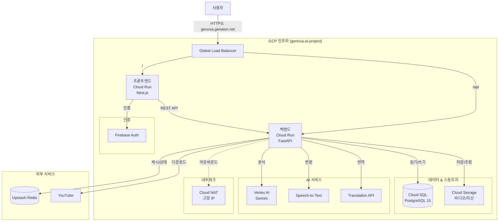
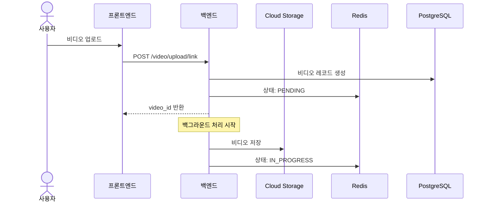
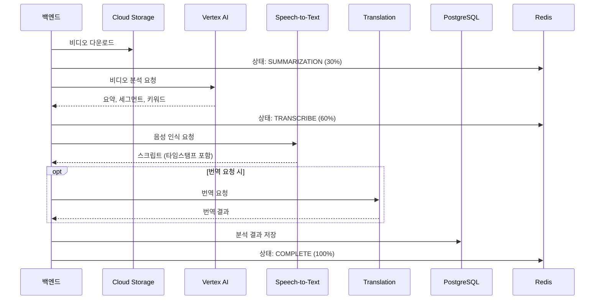
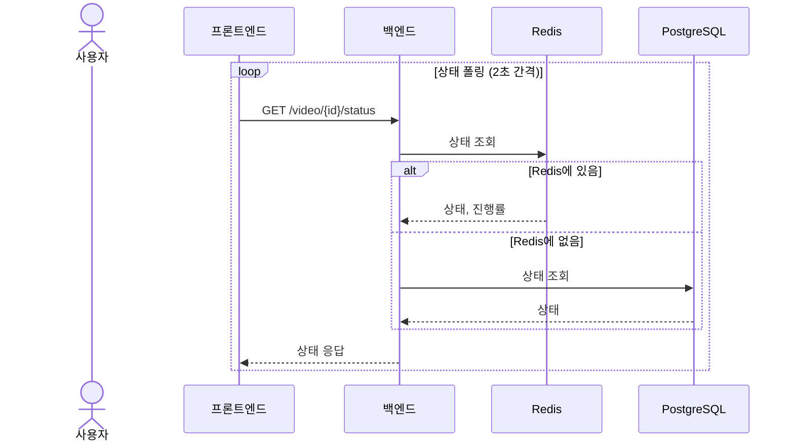

# 시스템 아키텍처

이 문서는 Genova AI 시스템의 전체 아키텍처, 데이터 흐름, 인프라 구성을 설명합니다.

---

## 전체 아키텍처 다이어그램



---

## 인프라 구성 요약

| 구성요소 | 서비스 | 사양 |
|----------|--------|------|
| **프론트엔드** | Cloud Run | 512Mi RAM, 1 vCPU |
| **백엔드** | Cloud Run | 4Gi RAM, 2 vCPU |
| **데이터베이스** | Cloud SQL | PostgreSQL 15 |
| **캐시** | Upstash Redis | 서버리스 |
| **스토리지** | Cloud Storage | 비디오 저장소 |
| **AI** | Vertex AI | Gemini 2.5 Flash |
| **리전** | asia-northeast3 | 서울 |

---

## 프론트엔드 아키텍처

### 인프라 사양

| 항목 | 값 |
|------|-----|
| 서비스명 | genova-frontend |
| 리전 | asia-northeast3 |
| 메모리 | 512Mi |
| CPU | 1 vCPU |
| 스케일링 | 0 ~ 10 인스턴스 |
| 이미지 | gcr.io/genova-ai-project/genova-frontend |

### 기술 스택

- **프레임워크**: Next.js 14 (App Router)
- **언어**: TypeScript
- **상태 관리**: Zustand (전역), React Query (서버)
- **스타일링**: Emotion (CSS-in-JS)
- **비디오**: Video.js

### 주요 페이지

| 경로 | 페이지 | 기능 |
|------|--------|------|
| `/` | 홈 | 비디오 업로드 |
| `/video/[id]/script` | 스크립트 | 자막/스크립트 확인 및 편집 |
| `/video/[id]/split` | 세그먼트 | 구간 분할 관리 |
| `/video/[id]/summary` | 요약 | AI 요약 확인 및 편집 |

---

## 백엔드 아키텍처

### 인프라 사양

| 항목 | 값 |
|------|-----|
| 서비스명 | genova-ai-backend |
| 리전 | asia-northeast3 |
| 메모리 | 4Gi |
| CPU | 2 vCPU (CPU Boost) |
| 스케일링 | 0 ~ 10 인스턴스 |
| 동시성 | 인스턴스당 10 요청 |
| 타임아웃 | 900초 (15분) |

### 레이어 구조

```
┌─────────────────────────────────────────┐
│            API Layer (FastAPI)          │
│         app/api/v1/*.py                 │
├─────────────────────────────────────────┤
│          Service Layer                  │
│         app/services/*.py               │
├─────────────────────────────────────────┤
│         Repository Layer                │
│       app/repositories/*.py             │
├─────────────────────────────────────────┤
│          Model Layer                    │
│         app/models/*.py                 │
├─────────────────────────────────────────┤
│      Database (PostgreSQL + Redis)      │
└─────────────────────────────────────────┘
```

### 주요 서비스 모듈

| 서비스 | 파일 | 역할 |
|--------|------|------|
| VideoService | video_service.py | 비디오 CRUD |
| VideoUploadService | video_upload_service.py | 업로드 처리 |
| VideoProcessingPipeline | video_processing_pipeline.py | 처리 파이프라인 |
| VertexAIService | vertex_ai_service.py | AI 분석 |
| SpeechToTextService | speech_to_text_service.py | 음성 인식 |
| TranslationService | translation_service.py | 번역 |
| GCSService | gcs_service.py | 스토리지 관리 |
| VideoStatusService | video_status_service.py | 상태 관리 |

---

## 데이터 흐름

### 비디오 업로드 흐름



### 비디오 처리 흐름



### 상태 폴링 흐름



---

## 상태 관리 (Redis + PostgreSQL)

### 처리 상태

| 상태 | 설명 | 진행률 |
|------|------|--------|
| PENDING | 대기 중 | 0% |
| UPLOADING | 업로드 중 | 0-20% |
| UPLOADING_TO_GCS | GCS 업로드 중 | 20-30% |
| IN_PROGRESS | 처리 중 | 30% |
| SUMMARIZATION | AI 분석 중 | 30-80% |
| TRANSCRIBE | 음성 인식 중 | 80-95% |
| FINALIZING | 마무리 중 | 95-99% |
| COMPLETE | 완료 | 100% |
| FAILED | 실패 | - |
| CANCELED | 취소 | - |

### 상태 저장 전략

| 저장소 | 용도 | 특징 |
|--------|------|------|
| **Redis** | 실시간 상태 | 빠른 읽기/쓰기, 임시 |
| **PostgreSQL** | 최종 상태 | 영구 저장, 트랜잭션 |

- 처리 중: Redis에서 상태 관리
- 완료 후: PostgreSQL에 최종 결과 저장

---

## 데이터베이스 스키마

### ERD 개요

```
┌─────────────┐       ┌─────────────┐
│   videos    │───────│  segments   │
└─────────────┘       └─────────────┘
       │                     │
       ▼                     ▼
┌─────────────┐       ┌─────────────────────┐
│   video     │       │     segment         │
│ translations│       │   translations      │
└─────────────┘       └─────────────────────┘
```

### 주요 테이블

**videos**
- id, title, description
- status, processing_progress
- summary, keywords
- gcs_path
- created_at, updated_at

**segments**
- id, video_id
- segment_no, start_time, end_time
- title, summary, keywords, scripts
- class_type

> 상세 스키마: [ax-agriedu-back-v3/docs/completed/DATABASE.md](../ax-agriedu-back-v3/docs/completed/DATABASE.md)

---

## 네트워크 구성

### 도메인 및 라우팅

| 도메인 | 라우팅 | 서비스 |
|--------|--------|--------|
| genova.genaion.net | / | 프론트엔드 |
| genova.genaion.net | /api | 백엔드 |

### SSL/TLS

- Google-managed SSL 인증서 사용
- 인증서명: genova-ssl-cert

### Cloud NAT

외부 API 호출용 고정 IP:
- IP: 34.22.78.155
- 용도: YouTube API, 외부 URL 다운로드

---

## 보안 구성

### 인증

| 대상 | 방식 |
|------|------|
| 사용자 인증 | Firebase Auth |
| API 인증 | API Key (X-API-Key 헤더) |

### Cloud Run 보안

- 공개 접근 허용 (API Key로 보호)
- VPC Connector로 내부 리소스 접근
- 서비스 계정 기반 IAM

---

## 참고 문서

- [통합 아키텍처 상세](../ax-agriedu-back-v3/INTEGRATED_ARCHITECTURE.md)
- [사용자 워크플로우](../ax-agriedu-back-v3/USER_WORKFLOW.md)
- [인프라 상세](./09-INFRASTRUCTURE_DETAILS.md)
