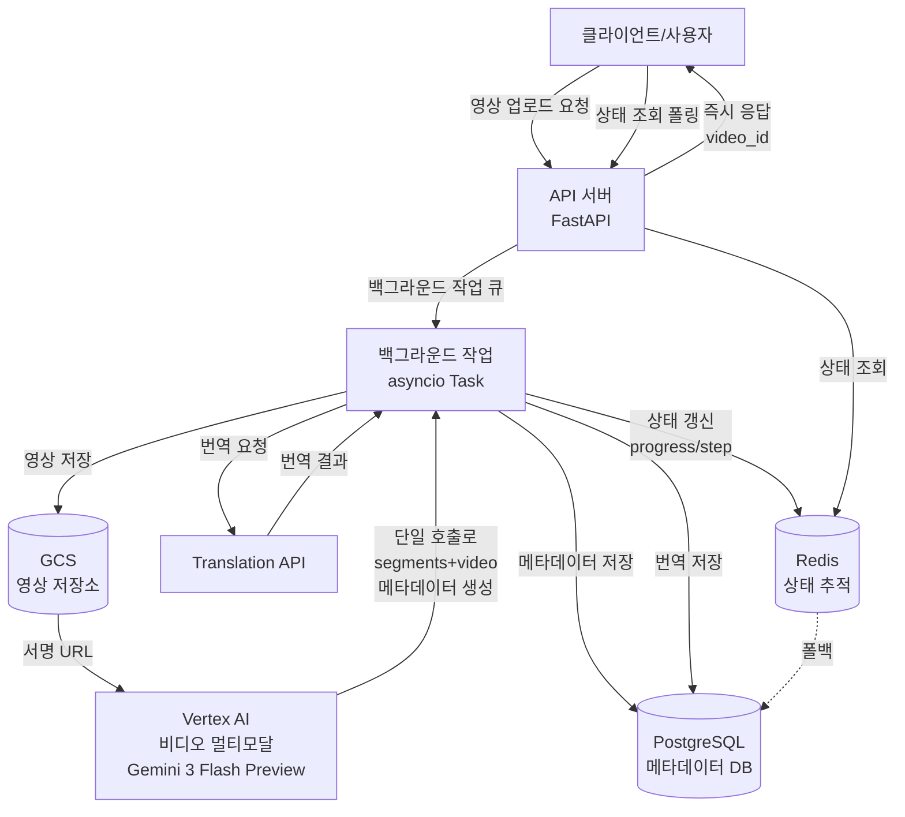
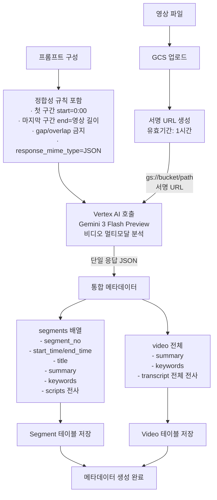
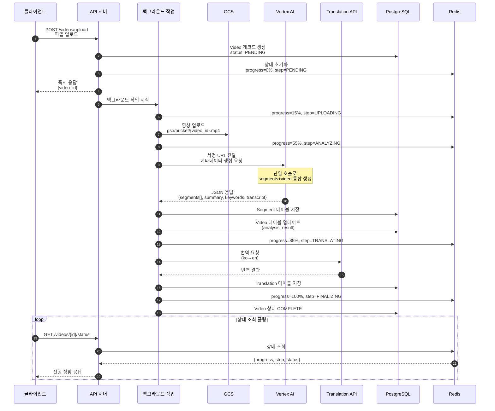
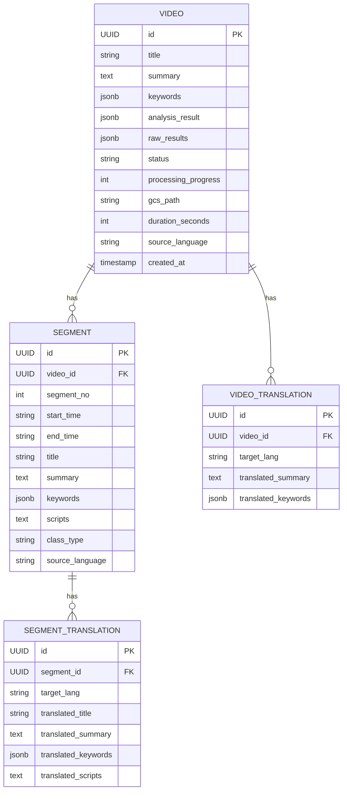
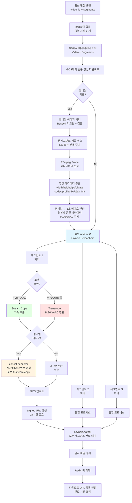

3. 배경기술
디지털 콘텐츠 분야에서 영상(Video)은 교육, 마케팅, 방송 등 다양한 산업에서 핵심 매체로 활용되나, 영상의 길이가 길고 주제 전환이 빈번하여 사용자가 필요한 부분을 신속히 찾기 어렵다. 이러한 문제를 해결하기 위해서는 영상에 대한 구조화된 메타데이터(세그먼트별 시간 구간, 제목, 요약, 키워드, 전사 텍스트 등)가 필수적이나, 이를 수작업으로 생성할 경우 시간·비용이 과다하게 소요되고 품질 편차가 크다.

종래의 자동 메타데이터 생성 기술은 다음과 같은 한계를 가진다:

(i) **메타데이터 산발 생성 및 API 호출 비효율**: 전사(STT API), 세그먼트 분할(Video AI), 요약(Language AI), 번역(Translation API) 등이 독립된 외부 API로 **순차적·개별 호출**되어, API 호출 횟수가 과다하고(비용 증가), 처리 시간이 길며(직렬 처리), 각 단계 결과 간 맥락 불일치(세그먼트와 전사 텍스트 간 시간 구간 불일치 등) 문제가 발생한다.

(ii) **메타데이터 구조화 미흡**: 생성 결과가 각 API별로 분산된 평면적 데이터로 제공되어, 세그먼트 단위 조회, 구간별 다국어 지원, 콘텐츠 검색/분석 등 실용적 활용에 필요한 계층적·구조적 저장이 어렵다.

(iii) **고비용 STT API 의존**: 영상 전사를 위해 고비용의 Speech-to-Text API를 무조건 호출하여 처리 비용이 과다하게 발생한다.

(iv) **대용량 처리 안정성 저하**: 영상 파일 처리(업로드/다운로드/인코딩/분석) 과정에서 HTTP 타임아웃 및 서버 부하 발생으로 메타데이터 생성 실패율이 높고, 처리 상태를 실시간으로 추적할 수 없어 사용자 경험이 저하되며 재처리 비용이 증가한다.

(v) **메타데이터 영속화 및 재활용 체계 부재**: 생성된 메타데이터가 임시 결과로만 제공되고 구조화된 데이터베이스에 영구 저장되지 않아, 콘텐츠 재분석 시 매번 고비용 AI API를 재호출해야 하며, 메타데이터 기반 검색·분석·추천 등의 부가가치 창출이 불가능하다.

따라서 영상으로부터 **세그먼트·전사·요약·키워드를 단일 AI 호출로 통합 생성**하여 API 비용 및 처리 시간을 최소화하고, **대용량/장시간 영상에 대해 비동기 백그라운드 처리 및 실시간 상태 추적**을 제공하며, **생성된 메타데이터를 구조화된 데이터베이스에 영속 저장**하여 재활용 및 부가가치 창출을 가능하게 하는 기술적 수단이 요구된다.

5. 본 발명의 구성 (과제의 해결 수단)
본 발명에 따른 영상 메타데이터 통합 생성 및 관리 시스템은, **(1) 단일 AI 호출 기반 메타데이터 통합 생성, (2) 클라우드 기반 영상 저장 및 보안 접근 제어, (3) 계층적 메타데이터 영속화, (4) 메타데이터 다국어화, (5) 비동기 백그라운드 처리 및 상태 추적, (6) 오류 처리 및 복구, (7) AI 메타데이터 기반 자동 영상 편집 및 숏폼 생성**의 7개 구성으로 이루어진다. 각 구성은 유기적으로 연동하여, 대용량/장시간 영상으로부터 **API 비용 및 처리 시간을 최소화**하면서 **정합성이 보장된 메타데이터를 안정적으로 생성**하고, **구조화된 데이터베이스에 영구 저장**하며, 생성된 메타데이터를 활용하여 **즉시 배포 가능한 숏폼 영상을 자동 생성**함으로써 재활용 및 부가가치 창출을 가능하게 한다.

## [핵심 구성]

(1) **단일 AI 호출 기반 통합 메타데이터 생성 모듈**
생성형 AI(Vertex AI 비디오 멀티모달 모델, 예: Gemini 3 Flash Preview)를 이용하여 영상의 **구조화된 메타데이터를 단일 API 호출로 통합 생성**한다. 구체적으로:

- **고비용 STT API 대체 및 통합 생성**: 종래 기술이 **고비용 Speech-to-Text API 호출(영상 전사)** → 세그먼트 분할 API → 요약 생성 API → 키워드 추출 API를 **4회 개별 호출**하는 반면, 본 발명은 **비디오 멀티모달 AI 1회 호출**로 다음을 동시 생성:
  - 영상 전체 요약(summary), 주요 키워드(keywords), **전체 전사(full transcript)** ← STT API 대체
  - 세그먼트 목록(segments): 각 세그먼트의 시작/종료 시간(start_time/end_time), 제목(title), 요약(summary), 키워드(keywords), **전사 텍스트(scripts)** ← STT API 대체

  이를 통해 **고비용 STT API를 완전히 배제**하고, 비디오 멀티모달 AI가 영상을 직접 분석하여 음성 전사까지 포함한 모든 메타데이터를 생성한다.

- **프롬프트 기반 메타데이터 정합성 규칙 강제**: AI 호출 시 프롬프트에 다음 규칙을 포함하여 생성 결과의 정합성을 원천적으로 확보:
  - "첫 세그먼트 start_time=0:00"
  - "마지막 세그먼트 end_time=영상 총 길이(MM:SS 형식)"
  - "세그먼트 간 겹침(overlap)/공백(gap) 금지"
  - "JSON 스키마 준수 (response_mime_type=application/json)"

- **맥락 일관성 보장**: 단일 AI 호출로 전사·세그먼트·요약을 **동일 맥락(context) 내에서** 생성하여, 종래 기술의 산발적 API 호출 방식 대비 세그먼트 구간과 전사 텍스트 간 불일치 문제를 원천적으로 해결

**효과**:
- **STT API 비용 100% 절감** (완전 대체)
- API 호출 횟수 75% 감소 (4회 → 1회: STT + 세그먼트 + 요약 + 키워드 → 단일 호출)
- 처리 시간 단축 (순차 호출 제거)
- API 비용 대폭 절감 (STT 비용 100% 절감 + 호출 횟수 75% 감소 효과)
- 메타데이터 간 정합성 원천 보장

(2) **클라우드 기반 영상 저장 및 보안 접근 제어 모듈**
영상 파일을 클라우드 오브젝트 저장소(Google Cloud Storage)에 저장하고, AI 분석 서비스가 안전하게 접근할 수 있도록 제한 시간 기반 서명 URL(Signed URL)을 생성한다:

- **서명 URL 생성 및 접근 제어**:
  - 업로드된 영상을 GCS에 저장 후, AI 분석 호출 시 제한 시간(예: 1시간) 기반 서명 URL 생성
  - 서비스 계정 권한 및 URL 만료 시간을 통해 무단 접근 방지
  - Vertex AI가 서명 URL을 통해 영상에 접근하여 분석 수행 (영상 다운로드 불필요)

**효과**: 영상 파일의 안전한 저장 및 접근 제어, AI 분석 호출 시 보안성 확보

(3) **계층적 메타데이터 영속화 및 재활용 모듈**
생성된 메타데이터를 **구조화된 관계형 데이터베이스(PostgreSQL)에 계층적으로 영구 저장**하여, 재분석 시 AI API 재호출 없이 즉시 활용 가능하도록 한다:

- **계층적 데이터 모델**:
  - **Video 테이블**: 영상 전체 메타데이터 저장 (id, title, summary, keywords, analysis_result, raw_results, source_language, status, processing_progress, gcs_path, duration_seconds 등)
  - **Segment 테이블**: 세그먼트 메타데이터 저장 (id, video_id(FK), segment_no, start_time, end_time, title, summary, keywords, scripts, class_type, source_language 등)
  - **VideoTranslation/SegmentTranslation 테이블**: 다국어 번역 메타데이터 저장 (target_lang, translated_summary, translated_keywords, translated_scripts 등)

- **원본 및 가공 결과 분리 저장**:
  - `raw_results` 필드: AI 원본 응답 JSON 저장 (재처리/검증/품질 개선용)
  - `analysis_result` 필드: 정제된 메타데이터 JSON 저장 (실용 활용용)
  - 세그먼트별 필드: title, summary, keywords, scripts 개별 저장 (조회 효율화)

- **재활용 메커니즘**: 동일 영상 재분석 요청 시, 데이터베이스에 저장된 메타데이터 즉시 반환 (AI API 재호출 불필요 → 비용 절감 및 응답 속도 향상)

**효과**: 메타데이터 영구 자산화, 재분석 시 AI API 비용 100% 절감, 응답 속도 10배 이상 향상 (AI 호출 수십초 → DB 조회 수백ms), 메타데이터 기반 검색·분석 인프라 구축 가능

(4) **메타데이터 다국어화 모듈**
Google Cloud Translation API를 이용하여 메타데이터를 다국어로 확장한다:
- **계층 구조 보존 번역**: Video 전체 (summary, keywords) 및 Segment 개별 (title, summary, keywords, scripts)을 각각 번역하되, Video-Segment 계층 구조 및 시간 구간은 그대로 유지
- **조건부 번역**: 언어 감지를 통해 source_language ≠ target_language 시에만 번역 호출 (불필요한 API 비용 방지)
- **분리 저장**: 원문(Video/Segment 테이블)과 번역문(VideoTranslation/SegmentTranslation 테이블)을 별도 테이블에 저장하여 언어별 독립 조회 및 대조 분석 지원

**효과**: 다국어 콘텐츠 접근성 확보, 언어별 메타데이터 독립 관리

(5) **비동기 백그라운드 처리 및 상태 추적 모듈**
대용량/장시간 영상 처리 시 HTTP 타임아웃 및 서버 부하를 방지하기 위해 **비동기 백그라운드 처리**를 적용하고, **실시간 상태 추적**을 제공한다:

- **비동기 백그라운드 작업 큐(Background Task Queue)**:
  - 사용자의 영상 업로드 요청에 대하여 HTTP 응답을 즉시 반환(video_id 제공)
  - 실제 처리(GCS 업로드 → AI 분석 → 세그먼트 저장 → 번역 → 완료)는 백그라운드 작업(asyncio Task)으로 비동기 수행
  - 사용자가 웹 브라우저를 닫아도 서버 내부에서 처리 계속 진행

- **실시간 상태 추적(Redis 기반)**:
  - Redis 캐시에 처리 상태 정보 저장: `video_status:{video_id}` → `{status, step, progress}`
  - 처리 단계(step): UPLOADING → ANALYZING → SUMMARIZATION → TRANSLATING → FINALIZING
  - 진행률(progress): 0% → 15% → 55% → 85% → 100%
  - 클라이언트가 상태 조회 API(`GET /api/v1/videos/{video_id}/status`)를 통해 실시간 확인 (폴링 방식)

- **폴백 메커니즘**: Redis 상태 데이터 만료 시 PostgreSQL에서 최종 상태 조회 (이중 안전장치)

**효과**: HTTP 타임아웃 문제 해결, 장시간 영상(1시간 이상) 처리 가능, 사용자 경험 개선 (실시간 진행 상황 확인)

(6) **오류 처리 및 복구 모듈**
외부 AI/번역 호출, 파일 처리 등의 단계에서 발생하는 일시적 오류에 대응하기 위하여 재시도/지수 백오프/타임아웃을 적용하고, 실패 정보를 데이터베이스 및 Redis에 기록하여 메타데이터 생성의 안정성을 향상시킨다.

(7) **AI 메타데이터 기반 자동 영상 편집 및 숏폼 생성 모듈**
생성된 세그먼트 메타데이터를 활용하여 원본 영상을 물리적으로 편집하고, 즉시 배포 가능한 숏폼(Short-form) 영상을 자동 생성한다:

- **FFmpeg 기반 세그먼트 물리적 분할**:
  - 세그먼트 메타데이터(start_time, end_time)를 기반으로 FFmpeg를 사용하여 원본 영상을 지정 구간별로 물리적 분할
  - Stream Copy 우선 적용: 코덱이 호환되는 경우(H.264/AAC) 재인코딩 없이 고속 복사 (처리 시간 10배 이상 단축)
  - 코덱 호환성 자동 감지: VP9/Opus 등 비호환 코덱은 H.264/AAC로 자동 트랜스코딩하여 범용 재생 환경 지원

- **썸네일 영상 자동 생성 및 병합**:
  - 사용자 제공 썸네일 이미지(Base64)를 원본 영상과 정확히 동일한 파라미터(해상도, FPS, 코덱, 비트레이트, SAR)의 1초 비디오 클립으로 자동 변환
  - FFmpeg concat demuxer를 사용하여 [썸네일 영상 1초 + 세그먼트]를 무손실 병합 (재인코딩 최소화)
  - 파라미터 정밀 매칭: 비트레이트, 프로파일, 레벨, 픽셀 포맷, 컬러 속성까지 원본과 완전 일치시켜 sync 문제 원천 차단

- **병렬 처리 및 성능 최적화**:
  - asyncio Semaphore를 사용한 동시 작업 제어 (기본 3개 병렬 처리)
  - 각 세그먼트를 독립적으로 병렬 생성하여 전체 처리 시간 최소화
  - 모든 FFmpeg 작업을 Thread Pool에서 실행하여 비동기 이벤트 루프 블로킹 방지

- **GCS 업로드 및 Signed URL 발급**:
  - 생성된 숏폼 영상을 GCS에 자동 업로드
  - 세그먼트별 다운로드용 Signed URL 자동 발급 (기본 24시간 유효)
  - Redis 락(Lock)을 사용한 중복 처리 방지

**효과**:
- 메타데이터 기반 완전 자동 편집 (수동 편집 작업 100% 제거)
- 즉시 배포 가능한 숏폼 영상 생성 (별도 편집 도구 불필요)
- Stream Copy 최적화로 처리 속도 10배 이상 향상 (재인코딩 최소화)
- 병렬 처리로 대량 세그먼트 고속 생성 (기본 3개 동시, 환경변수로 조정 가능)
- 범용 코덱 자동 변환으로 모든 재생 환경 호환성 확보

5.1 대표 도면(첨부 필수)
- **도 1: 시스템 전체 구성도** - 클라이언트–API 서버(FastAPI)–백그라운드 작업 큐–GCS(영상 저장소)–Vertex AI(메타데이터 생성)–Translation API(번역)–PostgreSQL(메타데이터 DB)–Redis(상태 추적) 연동 구성도
- **도 2: 단일 AI 호출 기반 통합 메타데이터 생성 흐름도** - GCS 저장 → 서명 URL 생성 → Vertex AI 호출(프롬프트: 정합성 규칙 강제, response_mime_type=JSON) → 단일 응답에서 segments(start/end/title/summary/keywords/scripts) + video(summary/keywords/transcript) 동시 생성 → 구조화 JSON 출력
- **도 3: 비동기 처리 파이프라인 및 상태 추적 시퀀스 다이어그램** - 클라이언트 업로드 요청 → API 즉시 응답(video_id) → 백그라운드 작업 시작 → Redis 상태 갱신(UPLOADING/ANALYZING/SUMMARIZATION/TRANSLATING/FINALIZING, 0-100%) → 클라이언트 상태 조회 폴링 → DB 최종 저장(COMPLETE)
- **도 4: 계층적 메타데이터 영속화 ERD** - Video 테이블(id, title, summary, keywords, analysis_result, raw_results, status, progress, gcs_path) ←1:N→ Segment 테이블(id, video_id(FK), segment_no, start_time, end_time, title, summary, keywords, scripts) ←1:N→ VideoTranslation/SegmentTranslation 테이블(target_lang, translated_* 필드)
- **도 5: 메타데이터 기반 자동 영상 편집 프로세스** - DB에서 세그먼트 메타데이터 조회 → 썸네일 이미지를 1초 비디오 변환(원본 파라미터 매칭) → FFmpeg로 세그먼트 분할(Stream Copy/Transcode) → concat demuxer로 [썸네일+세그먼트] 병합 → 병렬 처리(asyncio) → GCS 업로드 → Signed URL 발급

5.2 대표 도면(mermaid)

### 도 1. 시스템 전체 구성도

### 도 2. 단일 AI 호출 기반 통합 메타데이터 생성 흐름도

### 도 3. 비동기 처리 파이프라인 및 상태 추적 시퀀스 다이어그램

### 도 4. 계층적 메타데이터 영속화 ERD

### 도 5. 메타데이터 기반 자동 영상 편집 프로세스

